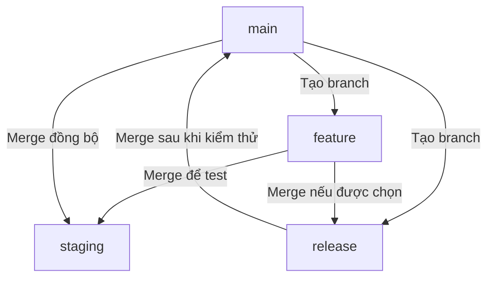

# Git flow: feature → release → main, staging chỉ nhận merge

## Mục tiêu

Giữ cùng commit feature trên staging và main để khi merge `main → staging`,
Git nhận ra phần đã có và chỉ xét thay đổi mới.

## Flow chính



## Các bước thực hiện

| Bước | Thực hiện | Kết quả |
| --- | --- | --- |
| 1 | Tạo feature từ `main` | Feature không mang theo các thay đổi chưa release trên staging |
| 2 | Merge `feature → staging`, kiểm thử | Staging nhận feature để test |
| 3 | Tạo release từ `main` | Release bắt đầu từ nền main |
| 4 | Merge cùng feature được chọn vào release | Release chỉ nhận các feature được duyệt |
| 5 | Kiểm thử release, merge `release → main` | Main nhận feature và release fix |
| 6 | Merge `main → staging` | Staging nhận fix mới và giữ feature đang phát triển |

Tạo feature:

```bash
git fetch origin
git switch -c feature/huynv106/BDSKD-XXXX origin/main
```

Tạo release:

```bash
git fetch origin
git switch -c release/20261001 origin/main
```

Các bước merge thực hiện qua MR trên GitLab. Tên ticket và ngày trong lệnh là ví dụ.

## Nguyên tắc bắt buộc của flow

- Staging chỉ nhận merge; không merge `staging → main/release/feature`.
- Dùng **cùng feature branch, cùng commit** cho staging và release.
- Dùng merge giữ ancestry; không cherry-pick, rebase hoặc squash riêng các MR trong flow.
- Không rewrite commit feature sau khi đã merge vào staging. Nếu cần sửa, thêm commit mới.
- Giữ feature branch đến khi release đã nhận đủ commit; không xóa ngay sau MR staging.
- Nếu sửa lỗi lúc UAT, tạo fix từ release và merge vào release. Staging nhận fix qua
  `release → main → staging`.
- Nếu sửa lỗi trên main, đồng bộ `main → staging` sau khi fix được duyệt.

“Không merge staging ra ngoài” nói về hướng merge, không tự cấm tạo branch từ staging.
Flow này chọn main làm base của feature/release để kiểm soát phạm vi phát hành.

## Vì sao main → staging sẽ ít thay đổi hơn?

Ví dụ staging đã nhận feature F. Release nhận **chính commit F**, sau đó merge vào main.

| Thời điểm | Main | Staging |
| --- | --- | --- |
| Feature được test | Code cũ | Code cũ + F |
| Release hoàn tất | Code cũ + F | Code cũ + F |
| Main có thêm fix H | Code cũ + F + H | Code cũ + F |
| Main merge về staging | Code cũ + F + H | Code cũ + F + H |

Git biết F đã có trên cả hai nhánh, nên phần nội dung mới cần nhận là H.
Nếu H chỉ sửa `pom.xml` và không có thay đổi khác, lần đồng bộ chỉ cần đổi `pom.xml`.

Flow mới không tự sửa lịch sử đã lệch. Với repository hiện tại, cần một lần merge
`main → staging`, review các khác biệt và resolve conflict để thiết lập lại nền chung.

## Checklist cho developer và AI agent

- Xác định đúng source/target và SHA đang review.
- Chọn merge giữ ancestry; không bật squash cho các MR của flow.
- Kiểm thử release thực tế; test staging không thay thế test release chọn lọc.
- Khi conflict, giữ feature staging và nhận fix main theo quyết định review.
- Kiểm tra delta cuối cùng so với target trước merge.
- Với production code change, chạy `./mvnw -B verify` theo
  [AGENTS.md](../AGENTS.md); nếu gate thiếu hoặc lỗi, báo rõ thay vì bỏ qua.
- Sau đồng bộ, source SHA phải là ancestor của target result SHA:
  `git merge-base --is-ancestor <source-sha> <result-sha>` trả exit code 0.

Merge MR là tích hợp code; tag và deploy là các bước riêng theo quy trình của team.
