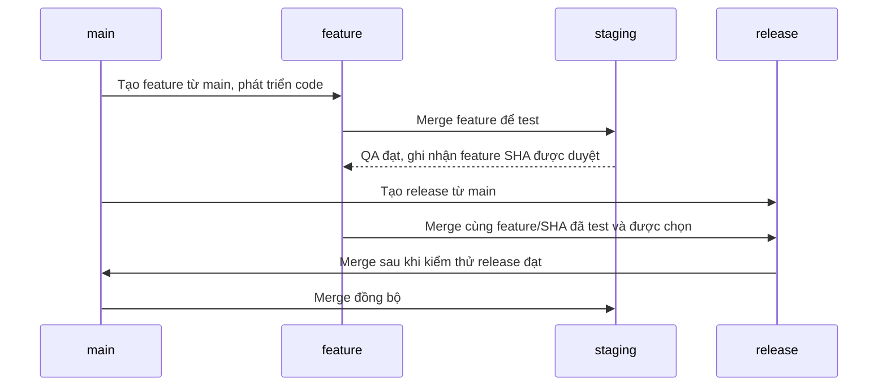

# Git flow: test staging trước, release sau

## Mục tiêu

Giữ cùng commit feature trên staging và main để khi merge `main → staging`,
Git nhận ra phần đã có và chỉ xét thay đổi mới.

## Flow chính



Mũi tên “QA đạt” là thông báo kết quả kiểm thử, không phải merge staging vào feature.
Chỉ đưa feature vào release sau khi QA trên staging đạt và feature được chọn phát hành.

## Các bước thực hiện

| Bước | Thực hiện | Kết quả |
| --- | --- | --- |
| 1 | Tạo feature từ `main`, phát triển code | Feature không mang theo các thay đổi chưa release trên staging |
| 2 | Merge `feature → staging` | Staging nhận feature để test |
| 3 | QA test trên staging | Có lỗi: sửa trên feature, merge lại staging và test lại; chỉ đi tiếp khi đạt |
| 4 | Tạo release từ `main`, merge cùng feature/SHA đã test và được chọn | Release chỉ nhận feature đã đạt QA và được duyệt |
| 5 | Kiểm thử release, merge `release → main` | Main nhận feature và release fix |
| 6 | Merge `main → staging` | Staging nhận fix mới và giữ feature đang phát triển |

Tạo feature:

```bash
git fetch origin
git switch -c feature/huynv106/BDSKD-XXXX origin/main
```

Tạo release:

```bash
git fetch origin
git switch -c release/20261001 origin/main
```

Các bước merge thực hiện qua MR trên GitLab. Tên ticket và ngày trong lệnh là ví dụ.

## Nguyên tắc bắt buộc của flow

- Staging chỉ nhận merge; không merge `staging → main/release/feature`.
- Feature phải được merge vào staging và QA đạt trước khi được đưa vào release.
- Dùng **cùng feature branch, cùng commit** cho staging và release.
- Dùng merge giữ ancestry; không cherry-pick, rebase hoặc squash riêng các MR trong flow.
- Không rewrite commit feature sau khi đã merge vào staging. Nếu cần sửa, thêm commit mới.
- Fix lỗi feature trên feature branch, merge lại staging và test lại. Nếu feature có
  commit mới sau QA, xác minh/test SHA mới trước khi đưa vào release.
- Giữ feature branch đến khi release đã nhận đủ commit; không xóa ngay sau MR staging.
- Nếu sửa lỗi lúc UAT, tạo fix từ release và merge vào release. Staging nhận fix qua
  `release → main → staging`.
- Nếu sửa lỗi trên main, đồng bộ `main → staging` sau khi fix được duyệt.

“Không merge staging ra ngoài” nói về hướng merge, không tự cấm tạo branch từ staging.
Flow này chọn main làm base của feature/release để kiểm soát phạm vi phát hành.

## Vì sao main → staging sẽ ít thay đổi hơn?

Ví dụ staging đã nhận feature F. Release nhận **chính commit F**, sau đó merge vào main.

| Thời điểm | Main | Staging |
| --- | --- | --- |
| Feature được test | Code cũ | Code cũ + F |
| Release hoàn tất | Code cũ + F | Code cũ + F |
| Main có thêm fix H | Code cũ + F + H | Code cũ + F |
| Main merge về staging | Code cũ + F + H | Code cũ + F + H |

Git biết F đã có trên cả hai nhánh, nên phần nội dung mới cần nhận là H.
Nếu H chỉ sửa `pom.xml` và không có thay đổi khác, lần đồng bộ chỉ cần đổi `pom.xml`.

Flow mới không tự sửa lịch sử đã lệch. Với repository hiện tại, cần một lần merge
`main → staging`, review các khác biệt và resolve conflict để thiết lập lại nền chung.

## Ví dụ: test 10 feature, chỉ release 5

Giả sử F1…F10 được tạo từ main. Staging nhận cả 10 để test. Sau QA, F1…F5 đạt và được
chọn phát hành; release nhận chính các commit feature đã merge và test trên staging.

| Thời điểm | Main | Staging |
| --- | --- | --- |
| Test 10 feature | Code cũ | Code cũ + F1…F10 |
| Release 5 feature vào main | Code cũ + F1…F5 | Code cũ + F1…F10 |
| Main merge về staging | Code cũ + F1…F5 | Code cũ + F1…F10 |

Git nhận ra F1…F5 đã có trên staging. Main chưa có F6…F10 không có nghĩa là yêu cầu
xóa chúng; merge vẫn giữ các feature chưa release, trừ quyết định khác khi resolve.

### Có thay đổi file hoặc conflict không?

| Tình huống | Khi main → staging |
| --- | --- |
| Release chỉ nhận F1…F5, không có thay đổi hoặc resolution khác | Có thể không đổi nội dung file; merge vẫn nối lịch sử |
| Release thêm fix R ở vùng staging chưa sửa | Thường tự nhận R, staging vẫn giữ F6…F10 |
| Fix R và F6…F10 sửa cùng vùng theo cách khác nhau | Có thể conflict, cần quyết định nội dung cuối cùng |
| Release và staging resolve conflict theo cách khác nhau | Có thể có delta hoặc conflict cần review |

Ví dụ: nền chung có `timeout = 10`, F6 trên staging đổi thành `30`, fix trên release
đổi thành `20`. Merge có thể conflict; reviewer phải quyết định giá trị cuối cùng.
Giữ ancestry giúp nhận ra phần đã có, không bảo đảm mọi lần merge đều hết conflict.

Trước release phải xác nhận F1…F5 có đủ dependency. Nếu F2 phụ thuộc F8, phải đưa cả F8
vào release hoặc hoãn F2. Kiểm thử riêng release gồm các feature được chọn: test thành
công trên staging với 10 feature chưa chứng minh tổ hợp 5 feature hoạt động đúng.

## Checklist cho developer và AI agent

- Xác định đúng source/target và SHA đang review.
- Feature SHA đưa vào release đã có trên staging và được QA duyệt.
- Chọn merge giữ ancestry; không bật squash cho các MR của flow.
- Feature được chọn release phải có đủ dependency.
- Kiểm thử release thực tế; test staging không thay thế test release chọn lọc.
- Khi conflict, giữ feature staging và nhận fix main theo quyết định review.
- Kiểm tra delta cuối cùng so với target trước merge.
- Với production code change, chạy `./mvnw -B verify` theo
  [AGENTS.md](../AGENTS.md); nếu gate thiếu hoặc lỗi, báo rõ thay vì bỏ qua.
- Sau đồng bộ, source SHA phải là ancestor của target result SHA:
  `git merge-base --is-ancestor <source-sha> <result-sha>` trả exit code 0.

Merge MR là tích hợp code; tag và deploy là các bước riêng theo quy trình của team.
