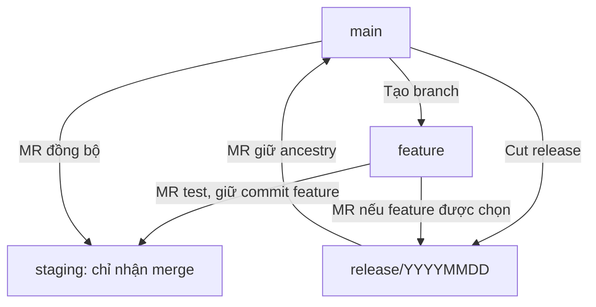

# Git branch flow: staging chỉ nhận merge, release từ main

## 1. Quy tắc nền tảng và mục tiêu

Quy tắc team đã xác nhận: **không merge staging vào bất kỳ branch nào**.
Quy tắc này nói về hướng merge: staging không được làm source của một lần merge sang
branch khác. Nó không tự động cấm tạo branch mới từ staging.

Tài liệu đề xuất feature phát hành và release được tạo từ main, rồi cùng commit feature
được merge vào staging/release. Đây là lựa chọn thiết kế để release chọn lọc và tránh
đưa lịch sử staging vào production, không phải một lệnh cấm tạo branch được suy ra từ
rule của team. Các chính sách còn lại cần đối chiếu quyết định team và setting GitLab.

Mục tiêu là staging nhận các thay đổi production mới mà không hiển thị lại hàng loạt
feature đã có, đồng thời release chỉ chứa các feature được duyệt.

Phân biệt rule đã xác nhận và cách triển khai được đề xuất:

- Rule: không mở MR `staging → main`, `staging → release` hoặc `staging → feature`.
- Tạo branch từ staging: thao tác này tự nó không vi phạm rule hướng merge.
- Đề xuất cho feature đi production: tạo từ main để có base sạch cho release chọn lọc.
- Đề xuất cho branch test/fix/helper tạo từ staging: merge trở lại staging; nếu muốn
  đưa sang main/release, phải kiểm tra toàn bộ ancestry và scope đi kèm.
- Staging có thể nhận MR từ feature, fix, hotfix, release hoặc main theo phạm vi được duyệt.

Ví dụ `git switch -c fix/staging-only origin/staging` chỉ tạo tên branch mới tại một
commit. Nó chưa thực hiện merge. Tuy nhiên branch mới chứa toàn bộ ancestry staging
tại thời điểm tạo. Merge branch đó vào main có thể đưa các commit staging khác vào
main, dù GitLab hiển thị source name là `fix/staging-only`. Không thể chỉ dựa vào tên
branch để kết luận đã giữ đúng phạm vi release.

Đọc tài liệu không tự cấp quyền commit, push, merge MR, tạo tag, thay đổi setting hay
deploy. Quyền thao tác theo yêu cầu đang thực hiện và `AGENTS.md` vẫn có hiệu lực.
Tài liệu này không thay đổi kiến trúc hoặc business contract.

### 1.1 Chọn flow trước khi chạy Git

| Nhu cầu | Tạo branch từ đâu? | MR đi đâu? | Đọc mục |
| --- | --- | --- | --- |
| Feature mới | Main | Feature → staging để test; cùng feature → release để phát hành | 5 |
| Release chọn lọc | Main | Các feature được chọn → release → main → staging | 6 |
| Sửa lỗi lúc UAT | Release | Fix → release; đồng bộ cùng fix về staging nếu cần | 7 |
| Hotfix production | Production SHA phù hợp trên main | Hotfix → main → staging; release đang UAT nhận fix nếu cần | 8 |
| Nhận một commit như bản vá pom.xml | Branch đích | Backport → branch đích | 9 |
| Sửa lịch sử main/staging đã lệch | Staging, làm branch hỗ trợ đích | Merge main vào helper rồi helper → staging | 11 |

Trong bảng, “tạo từ” chỉ base của branch mới. “X → Y” là hướng MR: X cung cấp thay
đổi, Y nhận thay đổi. Tạo branch không tự merge hoặc deploy.

Các command là ví dụ theo từng tình huống. Thay tên ticket/ngày/SHA bằng giá trị thật;
không chạy toàn bộ tài liệu như một script.

## 2. Những khái niệm cần hiểu

### 2.1 Branch, snapshot và ancestry

Branch là tên trỏ vào commit. Commit có snapshot file, parent và metadata.
Ancestry là khả năng lần ngược qua các parent để đến một commit khác.

Hai commit có patch giống nhau nhưng khác parent vẫn thường có SHA khác. Cherry-pick
copy patch sang lịch sử mới, không nối lịch sử nguồn:

```text
A---F       feature gốc, staging đã nhận F
 \
  F'        release nhận patch F bằng cherry-pick
```

F và F' có thể sửa cùng code. Tuy nhiên F không trở thành ancestor của release nhờ
cherry-pick. Đây là lý do code gần giống nhưng MR đồng bộ vẫn có thể rất lớn.

Merge giữ ancestry đưa **cùng commit F** vào lịch sử của cả hai nơi. Merge commit trên
staging và release có thể khác SHA; điều cần dùng chung là commit feature F.

### 2.2 Source, target và remote-tracking ref

| Thuật ngữ | Ý nghĩa |
| --- | --- |
| Source | Branch cung cấp thay đổi cho MR |
| Target | Branch nhận thay đổi |
| `origin/main` | Main trên remote được lần fetch gần nhất ghi nhận |
| `main` local | Branch main trên máy, có thể cũ hơn remote |
| `git fetch origin` | Cập nhật remote-tracking refs, không tự merge vào branch đang làm |
| Cut release | Tạo release tại một SHA main được chọn |
| Freeze | Chốt danh sách feature release; vẫn nhận fix được duyệt |
| UAT | Kiểm thử chấp nhận release candidate |
| Back-merge | Đưa kết quả production trở lại staging bằng merge |
| Backport | Chuyển chọn lọc một patch |
| Conflict resolution | Quyết định nội dung cuối cùng ở phần Git không tự kết hợp được |

Main là lịch sử release production được duyệt. Head main không nhất thiết là phiên
bản đang chạy nếu deployment chưa hoàn tất. Hotfix phải xác định production SHA thật.

### 2.3 MR nhiều file khác với merge thật sửa nhiều file

Git merge xét ba trạng thái: merge-base, target và source. Nó kết hợp các thay đổi
từ base đến mỗi phía, không thay toàn bộ target bằng snapshot source.

| Phép kiểm tra | Lệnh | Câu hỏi được trả lời |
| --- | --- | --- |
| MR diff thông thường | `git diff target...source` | Source thay đổi gì kể từ merge-base? |
| So hai snapshot | `git diff target source` | Hai trạng thái hiện tại khác nhau ở đâu? |
| Delta cuối cùng | `git diff target_before_sha result_sha` | Merge và resolve thực sự đưa gì vào target? |

Các tên ref/SHA trong bảng là ví dụ. Diff hiển thị trên GitLab còn phụ thuộc đúng refs
và phiên bản diff của MR. Không dùng số file MR để khẳng định số file merge thực sự đổi.

## 3. Flow tổng thể: feature cung cấp code cho cả staging và release



Không có mũi tên staging đi sang feature/release/main.

Ví dụ: feature OCR post-check được commit thành F. Team merge F vào staging để test.
Khi chọn phát hành, team merge chính feature branch chứa F vào release từ main.
Sau release, F là ancestor của cả staging và main.

Khi main có thêm hotfix H, Git biết F đã có ở staging. Đồng bộ main về staging sẽ xét
H và các thay đổi source thật sự chưa nhận, thay vì coi toàn bộ F là code mới.

Staging chứa feature chưa được chọn vẫn được giữ khi merge main vào staging, nếu
không có conflict hoặc quyết định nội dung khác. Feature đó không đi ngược vào release.

## 4. Chính sách giữ commit chung

| MR/thao tác | Chính sách | Lý do |
| --- | --- | --- |
| Feature → staging | Merge giữ ancestry; không squash/rebase feature đã dùng chung | Staging phải chứa commit feature thật |
| Cùng feature → release | Merge giữ ancestry; không tạo bản sao commit bằng cherry-pick | Release nhận cùng commit đã test trên staging |
| Release → main | Merge giữ ancestry; không squash toàn bộ release | Main nhận lịch sử feature và release fix |
| Main → staging | Merge giữ ancestry; không squash integration helper | Nối lịch sử production vào staging |
| Fix/hotfix vào nhiều đích | Dùng chung fix branch khi phù hợp | Tránh copy cùng fix thành nhiều SHA |
| Backport chọn lọc | Cherry-pick có chủ đích, dùng `-x` | Ngoại lệ cần truy vết nguồn, không thay thế đồng bộ branch |

Fast-forward cũng giữ ancestry nếu giữ nguyên commit. `--no-ff` tạo merge commit rõ
ràng, không phải điều kiện duy nhất để ancestry đúng.

Trong flow này feature được sử dụng trên cả staging và release, nên lời khuyên “feature
có thể squash tùy ý” không áp dụng. Nếu muốn gộp commit, thực hiện **trước khi feature
được merge lần đầu**, rồi dùng cùng commit đã gộp trên cả hai đích.

Sau khi feature đã được merge vào staging, giữ lịch sử ổn định. Fix thêm bằng commit
mới; không rebase/force-push để thay SHA đã được chia sẻ.

Feature branch không được nhận merge staging. Nếu cần cập nhật nền production, có
thể merge main vào feature theo quy trình team; phải kiểm tra phạm vi trước khi release.

Nếu feature B phụ thuộc feature A, tạo B từ main có A hoặc từ feature A được xác định
rõ; không lấy staging làm base để vô tình mang theo tất cả feature khác. Release B
phải có A và được kiểm thử với tập dependency đầy đủ.

Kiểm tra merge method, squash policy và quyền protected branch thực tế trên GitLab.
Nếu setting bắt buộc tạo SHA khác ở mỗi đích, báo xung đột với mục tiêu giữ commit chung.

## 5. Flow feature: phát triển → test staging → chọn vào release

Ví dụ cần thêm OCR post-check, production chưa có tính năng này.

### 5.1 Tạo feature từ main

```bash
git fetch origin
git switch -c feature/huynv106/BDSKD-XXXX origin/main
```

Sửa code, stage đúng file đã review và commit. Với code change, chạy quality gate
của repository: `./mvnw -B verify`.

Branch tạo từ main giúp feature không chứa các feature chưa release đang có ở staging.

### 5.2 Đưa feature vào staging để test

Khi được phép xuất bản:

```bash
git push -u origin feature/huynv106/BDSKD-XXXX
```

Mở MR:

```text
source: feature/huynv106/BDSKD-XXXX
target: staging
method: merge giữ ancestry, không squash
```

Ghi SHA feature đã review. QA test hành vi trên staging sau merge.
**Không xóa feature branch lúc này** nếu release chưa nhận nó.

### 5.3 Sửa feature sau khi QA phát hiện lỗi

Thêm commit fix vào chính feature branch từ main, rồi merge phần mới vào staging.
Không chỉ sửa trên staging: commit chỉ tồn tại ở staging không có đường phát hành
sang main theo rule của team.

Nếu conflict chỉ tồn tại do kết hợp nhiều feature trên staging, resolve ở staging
để test tích hợp. Không đưa toàn bộ resolution staging vào feature/release; đánh giá
lại conflict trên release và kiểm thử release candidate riêng.

### 5.4 Chọn feature vào release

Khi được duyệt, mở MR từ **cùng feature branch** vào release:

```text
source: feature/huynv106/BDSKD-XXXX
target: release/20261001
method: merge giữ ancestry, không squash
```

Ghi SHA source ở cả hai MR. Nếu feature tiến thêm sau lần QA đầu tiên, QA phải xác
minh SHA mới; “cùng branch name” không chứng minh “cùng code đã kiểm thử”.

### 5.5 Điều kiện kết thúc feature

Feature hoàn tất khi release/main và staging đã nhận các commit cần thiết, kiểm tra
đạt và các follow-up được xử lý. Có thể xóa branch sau khi các commit đã nằm trong
lịch sử đích và MR/SHA được ghi nhận.

## 6. Flow release: chọn feature từ main, phát hành, đồng bộ staging

### 6.1 Chọn base và danh sách feature

Release owner ghi:

- Main base SHA được chọn.
- Danh sách feature/fix SHA được phát hành.
- Dependency giữa các feature.
- Phiên bản dự kiến và kế hoạch kiểm thử.

Staging là nơi quan sát kết quả test tích hợp, không phải nguồn lịch sử cho release.

### 6.2 Tạo release từ main

```bash
git fetch origin
git switch -c release/20261001 origin/main
git rev-parse HEAD
```

Ghi SHA này thành `release_base_sha`. Khi được phép:

```bash
git push -u origin release/20261001
```

### 6.3 Merge các feature được chọn

Mở MR từng feature vào release, giữ nguyên lịch sử. Ví dụ staging có F1 và F2 nhưng
release chỉ chọn F1:

```text
feature/F1 → staging       đã test
feature/F2 → staging       đã test

feature/F1 → release       được chọn
feature/F2                 chưa phát hành
```

Không merge staging vào release để nhận F1. Không tạo release từ staging rồi revert
F2: cách đó vẫn đưa ancestry staging vào đường phát hành và làm scope khó kiểm soát.

### 6.4 Freeze và UAT đúng release candidate

Sau khi chọn đủ feature, chốt scope. Mỗi fix làm candidate SHA thay đổi và phải được
kiểm thử tương ứng.

Staging có F1 + F2 không chứng minh release chỉ có F1 hoạt động đúng. QA phải kiểm thử
release candidate thực tế: các feature có thể phụ thuộc hoặc tương tác khác nhau.

### 6.5 Merge release vào main

Mở MR `release/20261001 → main`, không squash/rebase các commit nguồn đã test.
Ghi `release_sha`, `main_before_sha` và `main_after_sha`.

Với các biến đã gán SHA thật:

```bash
git merge-base --is-ancestor "$release_sha" "$main_after_sha"
git diff --stat "$main_before_sha" "$main_after_sha"
git diff "$release_sha" "$main_after_sha"
```

Ancestry check phải trả exit code 0. Exit code 1 nghĩa là không có quan hệ; các lỗi
khác phải được xử lý riêng. Nếu tree main sau merge khác candidate release, kiểm
thử kết quả cuối cùng trước khi tuyên bố đạt kiểm tra release.

Tag, build/promote artifact và deploy là các bước riêng theo quyền được cấp.
Ghi SHA, tag, artifact digest, pipeline và deployment status. Không suy rằng đã deploy
chỉ vì MR merge thành công.

### 6.6 Merge main về staging

Mở MR `main → staging`, giữ ancestry. Nếu cần resolve trên helper, làm theo mục 10.

Staging đã có các commit feature được dùng chung nên Git không cần xem chúng là những
commit phát triển độc lập. Release fix hoặc thay đổi riêng hợp lệ trên main vẫn cần nhận.

### 6.7 Theo dõi nội dung qua một release

P0 là production ban đầu, F1 là feature được chọn, F2 là feature chưa phát hành, R là
fix QA trên release. Bảng minh họa giả định không có thay đổi production riêng khác.

| Thời điểm | Main | Staging | Release |
| --- | --- | --- | --- |
| Ban đầu | P0 | P0 | Chưa tạo |
| Feature được test | P0 | P0 + F1 + F2 | Chưa tạo |
| Cut từ main | P0 | P0 + F1 + F2 | P0 |
| Merge F1 vào release | P0 | P0 + F1 + F2 | P0 + F1 |
| QA fix release | P0 | P0 + F1 + F2 | P0 + F1 + R |
| Release vào main | P0 + F1 + R | P0 + F1 + F2 | P0 + F1 + R |
| Main về staging | P0 + F1 + R | P0 + F1 + F2 + R | P0 + F1 + R |

Ở bước cuối, F1 là cùng commit trên cả hai lịch sử, F2 vẫn chỉ ở staging, R được đưa
về staging. Đây là cách đáp ứng rule staging chỉ nhận merge mà không dựng lại cùng
feature thành nhiều commit độc lập.

## 7. Flow sửa lỗi lúc UAT

Ví dụ QA phát hiện OCR post-check sai một trường trong release.

1. Tạo fix branch từ release candidate.
2. Sửa, commit, chạy kiểm tra.
3. MR fix vào release, giữ ancestry.
4. QA kiểm thử candidate mới.
5. Nếu staging cần fix ngay, merge cùng fix branch vào staging sau khi review scope.
6. Nếu chưa cần ngay, staging nhận fix qua `release → main → staging`.

```bash
git fetch origin
git switch -c fix/huynv106/BDSKD-YYYY-release origin/release/20261001
```

Một fix branch từ release có cả ancestry release. Trước khi merge nó vào staging,
xác minh các commit đi kèm đều phù hợp. Nếu không, backport fix chọn lọc và ghi rõ ngoại lệ.

Nếu sau lần đưa fix vào release còn thêm commit, ghi lại candidate SHA và kiểm thử
lại. Không bỏ sót fix bằng cách chỉ sửa trực tiếp một file trên staging.

## 8. Flow hotfix production

Ví dụ production lỗi liveness, staging có feature chưa duyệt.

### 8.1 Chọn base đúng production

Xác minh phiên bản đang chạy. Nếu origin/main chính là phiên bản đó:

```bash
git fetch origin
git switch -c hotfix/huynv106/BDSKD-ZZZZ origin/main
```

Nếu main đã chứa release chưa deploy, cần chọn production SHA và đường phát hành
phù hợp; không tự phát hành code chưa duyệt chỉ để lấy một hotfix.

### 8.2 Đưa fix lên production và về staging

1. Sửa và kiểm thử trên hotfix.
2. MR `hotfix → main`, giữ ancestry.
3. Xác minh kết quả, tag/artifact/deploy theo scope được cấp.
4. MR `main → staging`, giữ ancestry.
5. Release đang UAT nhận hotfix nếu cần và được kiểm thử lại.

| Thời điểm | Main | Staging |
| --- | --- | --- |
| Trước fix | P1 | P1 + N |
| Hotfix vào main | P1 + H | P1 + N |
| Main về staging | P1 + H | P1 + N + H |

N chưa phát hành, H là hotfix. Main không nhận N vì staging không được dùng làm source.

MR main về staging chỉ nhỏ theo delta H khi lịch sử đã có nền chung phù hợp và main
không có thêm thay đổi khác. Rule hướng merge một mình không bảo đảm diff nhỏ.

## 9. Flow backport: chỉ nhận commit sửa pom.xml

Nếu main có nhiều khác biệt nhưng yêu cầu staging chỉ nhận dependency fix, tạo
backport branch từ staging:

```bash
git fetch origin
git switch -c backport/huynv106/security-dependencies origin/staging
git show --stat --oneline 6c92138
git cherry-pick -x 6c92138
git diff --stat origin/staging HEAD
git diff origin/staging HEAD
./mvnw -B verify
```

Trước thao tác phải kiểm tra prerequisite và patch đã tồn tại chưa.
Nếu cherry-pick conflict hoặc empty, giải thích và xử lý trước khi tiếp tục.

Khi đạt kiểm tra, xuất bản theo quyền được cấp và mở:

```text
backport/huynv106/security-dependencies → staging
```

Nghiệm thu scope: chỉ pom.xml thay đổi. `-x` ghi SHA nguồn vào commit message.

Backport helper từ staging chỉ quay về staging, không đưa vào main/release.
Backport không sửa ancestry main/staging. Đây là ngoại lệ lấy một fix, không phải cách
đồng bộ hàng loạt feature giữa các branch.

## 10. Chuẩn bị merge main về staging khi có conflict

Nếu worktree có thay đổi của người dùng, dùng worktree riêng. Ghim SHA source/target.
Branch này chỉ hỗ trợ target staging, không được dùng làm source release.

Các command có thể tạo merge commit; chỉ chạy khi tác vụ đã cho phép thao tác local
tương ứng. Dừng và kiểm tra khi một command lỗi.

```bash
git fetch origin
source_sha=$(git rev-parse origin/main)
target_sha=$(git rev-parse origin/staging)
integration_branch=merge/huynv106/main-to-staging-20261001
integration_parent=$(mktemp -d /tmp/ocr-ekyc-merge-XXXXXX)
integration_worktree="$integration_parent/worktree"
git worktree add -b "$integration_branch" "$integration_worktree" "$target_sha"
cd "$integration_worktree"
git merge --no-ff "$source_sha"
```

Nếu conflict:

```bash
git status --short
git diff --name-only --diff-filter=U
git diff --cc
```

Trong merge này, ours là staging/helper, theirs là main. Không áp dụng cách gọi đó
máy móc cho rebase. Resolve dựa trên hành vi cần giữ, không chọn toàn bộ một phía để
giảm số file.

Ví dụ staging có feature tìm kiếm chưa release, main có fix OCR: kết quả phải giữ
tìm kiếm và nhận fix OCR. Nếu main cố ý xóa diagnostic API vì security, quyết định
giữ/xóa API cần review riêng; không gọi đó là nhiễu lịch sử.

Stage đúng file đã review và hoàn tất merge commit. Kiểm tra:

```bash
git diff --name-only --diff-filter=U
git diff --check "$target_sha" HEAD
git diff --stat "$target_sha" HEAD
git diff "$target_sha" HEAD
git merge-base --is-ancestor "$source_sha" HEAD
git merge-base --is-ancestor "$target_sha" HEAD
./mvnw -B verify
```

Không còn unmerged paths; ancestry và quality gate phải đạt. Nội dung delta phải đúng
scope. Kiểm tra remote heads trước khi xuất bản/merge MR; head tiến thêm thì đánh giá
lại delta và kiểm tra bị ảnh hưởng.

Mở MR `integration helper → staging` khi được phép; không squash MR này.
Sau merge, main SHA đã ghim phải là ancestor của staging result SHA.

## 11. Chẩn đoán và xử lý lịch sử hiện tại

### 11.1 Bằng chứng trên refs kiểm tra ngày 01/10/2026

| Thuộc tính | Giá trị |
| --- | --- |
| Origin/main | `2bd4bb079c5a1c05961126fec9eb8b1c1e7b13ec` |
| Origin/staging | `4e31e5ffccb85dfc7b5eb0a825cf9a79ae907608` |
| Merge-base | `951eb5b12f4ac9891bbff66919072843b123bb56` |
| Commit riêng theo ancestry | Staging: 136; main: 112 |
| Three-dot diff | 215 file, +11.076 / -4.264 dòng |
| Snapshot diff | 16 file, +21 / -2.039 dòng |
| Dependency fix | `6c92138b9287fc247f4a8ff853516a4c93aebe20`: pom.xml, +16 dòng |

Đây là snapshot chẩn đoán trên refs đã kiểm tra, không phải dữ liệu bất biến.
Ví dụ patch tương đương: `de60750` trên staging và `52554f1` trên main sửa batch delete
media dưới SHA khác nhau.

Main còn khác staging ở static test UI, OpenAPI BFF, result/diagnostic API và một số
test. Vì vậy không thể kết luận đồng bộ toàn bộ main chỉ cần sửa pom.xml.

### 11.2 Một lần reconcile theo đúng rule

Rule cấm staging đi ra branch khác vẫn cho phép main đi vào staging:

1. Ghim main/staging SHA và chẩn đoán diff.
2. Lập quyết định cho từng khác biệt: nhận main, giữ staging, kết hợp hoặc cần review.
3. Tạo helper phía target staging và merge main vào helper theo mục 10.
4. Resolve conflict theo quyết định; kiểm tra delta, ancestry và quality gate.
5. MR helper về staging, giữ ancestry.
6. Các feature/release mới đi từ main theo mục 5–6, không nhận lịch sử staging.

Main không bị thay đổi trong bước reconcile này. Main trở thành ancestor của kết quả
staging, giúp merge-base tiến lên cho các lần đồng bộ tiếp theo.

Nếu team chủ động giữ nội dung staging khác main, phải ghi rõ trong MR. Ancestry vẫn
đánh dấu main đã được nhận; những patch source bị loại khi resolve không tự xuất hiện
như thay đổi mới ở lần merge sau.

Feature cũ tạo từ staging không được đưa thẳng vào release mới: nó có thể mang theo
các feature khác qua ancestry. Với feature chưa phát hành, kiểm tra commit đã có trên
main chưa, dependency và scope; nếu cần, dựng branch sạch từ main và backport chọn lọc
có ghi nguồn. Staging nhận lịch sử main sau release và reconcile các khác biệt đó.

Không dùng `git merge -s ours`, restore toàn bộ staging rồi chỉ copy pom.xml, reset
hoặc force-push branch lâu dài như cách mặc định làm đẹp diff.

### 11.3 Các lệnh chẩn đoán

```bash
git fetch origin
git log -1 --format='%H %s' origin/main
git log -1 --format='%H %s' origin/staging
git merge-base --all origin/staging origin/main
git rev-list --left-right --count origin/staging...origin/main
git log --left-right --cherry-mark --no-merges --oneline origin/staging...origin/main
git diff --stat origin/staging...origin/main
git diff --stat origin/staging origin/main
git diff --name-status origin/staging origin/main
```

Commit count bao gồm commit và merge commit chỉ reachable ở từng phía, không phải
số thay đổi nghiệp vụ. Dấu `=` của cherry-mark là patch tương đương, không thiết lập
ancestry hay chứng minh runtime tương đương.

Nếu có nhiều merge-base, kiểm tra merge thật trong worktree thay vì chọn tùy ý một base.
Git cũ có thể không hỗ trợ `merge-tree --write-tree`; kiểm tra phiên bản trước khi dùng.

## 12. Hợp đồng cho AI agent

### 12.1 Đầu vào phải xác định

| Trường | Nội dung |
| --- | --- |
| Intent | Feature, release, release fix, hotfix, backport hoặc reconcile |
| Source/target | Ref và SHA trước thao tác |
| Scope | Commit/hành vi cần nhận, nội dung target phải giữ |
| Release context | Main base, production SHA, feature dependency, candidate SHA |
| Authority | Quyền local edit, commit, push, MR, merge, tag, deploy đã cấp |
| Validation | Quality gate và bằng chứng cần báo cáo |

### 12.2 Quy tắc thực thi

1. Đọc AGENTS.md và convention liên quan. Không sửa trực tiếp managed files.
2. Thu thập worktree status, remote refs, merge-base và phạm vi diff trước khi sửa.
3. Rule cấm staging làm source merge, không tự cấm tạo branch từ staging. Theo flow
   đề xuất, feature/release đi production dùng main base; kiểm tra ancestry nếu base khác.
4. Feature dùng chung trên staging/release phải giữ commit SHA ổn định.
5. Main/release có thay đổi khác thì review đầy đủ, không tự nhận scope chỉ một file.
6. Chọn merge để đồng bộ lịch sử; chọn backport khi yêu cầu đúng một patch.
7. Giữ thay đổi của người dùng; dùng worktree riêng khi cần.
8. Ghi quyết định conflict, kiểm tra kết quả và quyền trước thao tác xuất bản.
9. Báo SHA, delta file, kiểm tra và phần chưa hoàn tất.

Không triển khai fix/business change nếu yêu cầu chỉ là giải thích hoặc chẩn đoán.
Nếu sửa kiến trúc/business contract, đọc thêm các tài liệu AGENTS.md chỉ định.

### 12.3 Trường hợp phải xử lý trước khi tiếp tục

- Branch source chứa lịch sử staging nhưng được đề xuất merge vào main/release.
- Feature dùng chung đã bị squash/rebase thành các SHA khác nhau.
- Không rõ quyết định giữ/xóa security fix, API hoặc migration trong conflict.
- Main head không khớp production base của hotfix.
- Setting GitLab làm mất ancestry cần giữ.
- Quality gate thiếu hoặc thất bại.
- Source/target SHA tiến thêm sau review.

Agent tiếp tục kiểm tra độc lập an toàn nhưng không tự mở rộng scope hoặc báo hoàn
thành phần bị thiếu.

Hiện trạng đã kiểm tra: repository không track Maven Wrapper trong khi AGENTS.md yêu
cầu `./mvnw -B verify`. Với code change, phải kiểm tra lại và báo xung đột nếu còn;
không tự thay gate bằng `mvn verify` hoặc bỏ test để tuyên bố đạt.

## 13. Nghiệm thu và mẫu MR

### 13.1 Checklist

- [ ] Không có MR/merge dùng staging làm source sang feature/release/main.
- [ ] Branch tạo từ staging nếu đi main/release đã được đánh giá toàn bộ ancestry;
      không dùng tên helper để che các thay đổi ngoài scope.
- [ ] Feature/release có main base phù hợp; danh sách dependency được review.
- [ ] Feature được dùng chung trên staging/release giữ đúng commit SHA.
- [ ] Release candidate thực tế được kiểm thử, không chỉ dựa vào staging test.
- [ ] Merge giữ ancestry; source SHA là ancestor của result SHA.
- [ ] Target feature và source fix được giữ theo quyết định review.
- [ ] Delta cuối cùng đúng scope; không còn conflict.
- [ ] Quality gate đạt trên kết quả cuối cùng.
- [ ] Remote heads tiến thêm đã được đánh giá lại.
- [ ] Release/hotfix được đồng bộ staging và release liên quan hoặc có ngoại lệ ghi rõ.
- [ ] Tag/artifact/deploy có bằng chứng khi nằm trong scope được cấp.

### 13.2 Mẫu MR

```markdown
## Mục tiêu

Đưa <feature/release/fix> từ <source> vào <target> theo rule staging chỉ nhận merge.

## Refs và phạm vi

- Source SHA:
- Target SHA trước merge:
- Main/production base SHA:
- Feature/fix SHA dùng chung nếu có:
- Hành vi thêm/sửa/xóa:
- Dependency và thay đổi ngoài phạm vi:

## Conflict và kiểm tra

- Conflict quan trọng và quyết định resolve:
- Result SHA:
- Delta cuối cùng:
- Ancestry check:
- Quality gate/pipeline và SHA được kiểm thử:

## Release và đồng bộ

- MR staging/release/main liên quan:
- Tag/artifact/deploy status nếu thuộc scope:
- Phần chưa hoàn tất:
```

## 14. Tài liệu repository liên quan

- [Repository instructions](../AGENTS.md)
- [Multi-AI convention adoption](conventions/multi-ai-adoption.md)
- [Code standards và review checklist](conventions/code-standards.md)
- [Archetype usage: Git và verification](conventions/archetype-usage.md)
