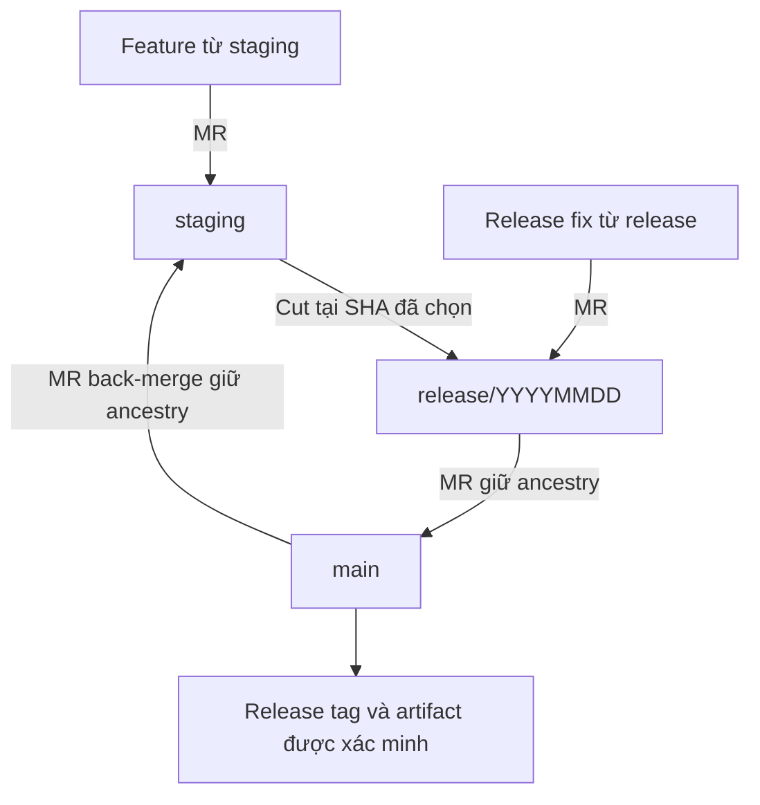

# GitFlow: release, hotfix và đồng bộ branch có giữ ancestry

## 1. Mục đích và phạm vi

Tài liệu này đề xuất quy trình Git cho repository `vhm-ocr-ekyc`, dành cho developer,
reviewer, release owner và AI agent. Mục tiêu là giữ quan hệ lịch sử giữa các branch,
đưa đúng thay đổi vào đúng đợt release và làm cho các MR đồng bộ phản ánh delta cần review.

Đây là đề xuất quy trình, không phải bằng chứng rằng GitLab đã được cấu hình hoặc team
đã áp dụng toàn bộ quy tắc dưới đây. `AGENTS.md`, quy định quyền thao tác và các quyết
định release đã được phê duyệt vẫn có hiệu lực. Các lệnh là hướng dẫn; việc đọc tài liệu
không tự cấp quyền push, merge MR, tạo tag hoặc deploy.

Quy trình không thay đổi kiến trúc ứng dụng, business contract hoặc cách chạy Liquibase.
Nếu một merge sửa production code, phải thực hiện quality gate của repository.

### 1.1 Cách đọc và chọn đúng flow

Nếu mới làm quen GitFlow, đọc bảng này trước, sau đó đọc các bước ở mục tương ứng.
`X → Y` nghĩa là mở MR lấy thay đổi từ X đưa vào Y; Y là branch được cập nhật.

| Bạn đang cần làm gì? | Flow | Đọc mục |
| --- | --- | --- |
| Phát triển tính năng mới hoặc sửa lỗi chưa lên production | `staging → feature → MR staging` | 5.1 |
| Chuẩn bị một đợt release | `staging → cut release → MR main → MR staging` | 5.2–5.6 |
| QA phát hiện lỗi trong release đang UAT | `release → fix → MR release → release tiếp tục UAT` | 5.3 |
| Production đang lỗi, cần sửa ngay | `production/main → hotfix → MR main → đồng bộ staging/release` | 8 |
| Chỉ muốn nhận một commit, ví dụ bản vá `pom.xml` | `target → backport → cherry-pick commit → MR target` | 9 |
| Main/staging code giống nhưng lịch sử bị lệch | `staging → integration branch → merge main → review → MR staging` | 11.2 |

Trong cột Flow, `cut`/`tạo branch` là đặt tên branch mới tại một commit hiện có.
`MR` là review và tích hợp thay đổi; tạo branch một mình chưa đưa thay đổi vào branch đích.

### 1.2 Các thuật ngữ cần biết

| Thuật ngữ | Hiểu theo thao tác thực tế |
| --- | --- |
| Branch | Một tên trỏ vào commit; tạo branch không tạo bản sao độc lập của lịch sử |
| Commit/SHA | Một mốc snapshot và lịch sử; SHA là mã định danh của mốc đó |
| `origin/staging` | Trạng thái staging trên remote được lần fetch gần nhất ghi nhận |
| `staging` local | Branch trên máy bạn; có thể cũ hơn `origin/staging` |
| `git fetch origin` | Cập nhật thông tin remote; không tự merge vào branch đang làm |
| Source/target | Source cung cấp thay đổi; target nhận thay đổi |
| Cut release | Tạo release branch tại SHA staging đã chọn, giữ nguyên lịch sử đến SHA đó |
| Freeze | Release không nhận thêm feature mới; vẫn có thể nhận fix được duyệt |
| UAT | Kiểm thử chấp nhận trước khi duyệt release |
| Back-merge | Merge thay đổi production/release trở lại branch tích hợp |
| Backport | Chuyển một patch cụ thể sang branch khác, thường bằng cherry-pick |
| Resolve conflict | Quyết định nội dung cuối cùng ở vùng Git không thể tự kết hợp |

Những command bên dưới là ví dụ theo từng tình huống, không phải một script chạy từ đầu
đến cuối. Chỉ chạy bước sau khi bước trước thành công và đúng tình huống đang xử lý.

## 2. First principles: Git xác định thay đổi như thế nào?

### 2.1 Snapshot và ancestry là hai thuộc tính khác nhau

Một commit lưu snapshot của cây file, liên kết đến các parent và metadata.
Ancestry là quan hệ có thể đi ngược từ một commit đến commit khác qua các liên kết parent.
Git không suy ra ancestry chỉ vì hai file hoặc hai patch có nội dung giống nhau.

Nếu cherry-pick commit `C` lên một lịch sử khác, thường nhận được commit mới `C'`:

```text
A---B---C       staging
     \
      D---C'    main
```

Patch của `C` và `C'` có thể tương đương. Tuy nhiên `C` không trở thành ancestor của
`main` chỉ nhờ cherry-pick. Git có thể phát hiện patch tương đương bằng một số lệnh
so sánh, nhưng merge-base vẫn được xác định bằng commit graph.

Merge commit có hai parent, nối hai lịch sử thật sự. Nội dung merge commit được xác
định bằng kết quả merge và cách resolve conflict, không tự động bằng snapshot source.

### 2.2 Merge dùng ba trạng thái

Với `source → target`, Git xét:

1. `base`: tổ tiên chung dùng làm cơ sở merge.
2. `target`: trạng thái branch nhận thay đổi.
3. `source`: trạng thái branch cung cấp thay đổi.

Git kết hợp thay đổi `base → target` và `base → source`. Các file được thêm trên cả
hai lịch sử có thể gây `add/add` conflict; các vùng cùng bị sửa có thể gây content
conflict. Hai branch có code gần giống nhau vẫn có thể conflict nếu base rất cũ.

### 2.3 Phân biệt ba loại kết quả

| Loại | Lệnh hoặc phép so sánh | Ý nghĩa |
| --- | --- | --- |
| MR diff thông thường | `git diff target...source` | Từ merge-base đến source; có thể chứa thay đổi target đã có bằng SHA khác |
| So hai snapshot | `git diff target source` | Nội dung hiện tại của hai branch khác nhau thế nào |
| Delta sau merge thử | `git diff target-before-merge HEAD` | Những thay đổi thật sự đưa vào target sau merge và resolve conflict |

Không dùng hai snapshot để kết luận chính xác kết quả merge: source có thể thiếu
feature mới trên target, nhưng three-way merge vẫn giữ feature đó. Kết quả MR trên
GitLab còn phụ thuộc phiên bản diff và refs của MR; phải kiểm tra đúng SHA đang review.

Giữ ancestry giúp loại bỏ việc hiển thị lại thay đổi cũ đã được merge. Nó không bảo
đảm source chỉ sửa một file: nếu source có thêm các thay đổi hợp lệ khác, chúng vẫn
thuộc phạm vi cần xem xét.

## 3. Vai trò của branch và các invariant

| Branch | Tạo từ | Vai trò | Nơi nhận thay đổi |
| --- | --- | --- | --- |
| `main` | Lịch sử production | Lịch sử release được duyệt; release tag xác định phiên bản deploy cụ thể | Release, hotfix |
| `staging` | Lịch sử tích hợp | Tích hợp feature cho các release tiếp theo; tương đương `develop` | Feature, back-merge, backport được duyệt |
| `feature/<owner>/<ticket>` | `origin/staging` | Một feature hoặc sửa lỗi phát triển thông thường | MR vào `staging` |
| `release/YYYYMMDD` | Một SHA đã chọn của `origin/staging` | Đóng băng phạm vi release, nhận release fix | MR vào `main`, đồng bộ về `staging` |
| `fix/<owner>/<ticket>-release` | Release đang xử lý | Sửa lỗi thuộc release đã đóng băng | MR vào release |
| `hotfix/<owner>/<ticket>` | SHA production cần sửa trên `main` | Sửa lỗi production | MR vào `main`, sau đó đồng bộ về các nhánh liên quan |
| `backport/<owner>/<ticket>` | Branch đích cần nhận patch | Chuyển chọn lọc một thay đổi | MR vào branch đích |

Tên branch có thể điều chỉnh theo convention của team; quan hệ tạo branch phải giữ
đúng như bảng. `main` chỉ trùng phiên bản đang chạy khi deploy đã hoàn tất và không có
release mới chờ deploy; không tự suy ra trạng thái production từ tên branch.

Các invariant bắt buộc của quy trình đề xuất:

1. Release được cắt từ SHA thật của `staging`, không dựng lại bằng hàng loạt cherry-pick.
2. Merge giữa các branch lâu dài giữ nguyên ancestry; không squash toàn bộ release.
3. Mọi release fix và hotfix phải được chuyển về `staging` và release đang hoạt động
   nếu cần, với MR hoặc quyết định không áp dụng có ghi nhận rõ ràng.
4. Không đưa feature của release sau vào một release đã đóng băng bằng merge toàn bộ `staging`.
5. Không rewrite lịch sử đã chia sẻ để làm đẹp MR diff.
6. Resolve conflict là quyết định về nội dung; phải review delta cuối cùng và chạy kiểm tra.
7. Merge một commit vào lịch sử không chứng minh tất cả hành vi của commit đó được giữ.

## 4. Chính sách merge trên GitLab

| MR | Phương thức đề xuất | Điều kiện |
| --- | --- | --- |
| `feature → staging` | Squash hoặc merge giữ ancestry | Nếu squash, xóa/kết thúc feature và tạo feature tiếp theo từ target mới |
| `release → main` | Merge commit, không squash/rebase source | Release SHA được kiểm thử phải là ancestor của kết quả |
| `main → staging` | Merge giữ ancestry, không squash | Review toàn bộ delta production cần chuyển về |
| `release → staging` | Merge giữ ancestry, không squash | Áp dụng biến thể ở mục 7 |
| `hotfix → main` | Merge giữ ancestry, không squash | Giữ hotfix SHA để truy vết và đồng bộ |
| `hotfix → release/staging` | Merge giữ ancestry | Source không kéo theo thay đổi ngoài phạm vi được duyệt |
| `backport → target` | MR patch chọn lọc | Ghi nguồn bằng `cherry-pick -x`; không gọi đây là đồng bộ toàn bộ branch |

Fast-forward cũng giữ ancestry nếu không rewrite commit. `--no-ff` được dùng trong
ví dụ để có một merge commit rõ ràng cho release, không phải vì fast-forward làm mất ancestry.

Trước khi áp dụng, kiểm tra merge method, squash policy, quyền protected branch và
pipeline thực tế của project. Nếu setting bắt buộc rebase/squash làm mất SHA release
đã kiểm thử, báo xung đột quy trình; không âm thầm dùng phương thức khác.

Các branch `main`, `staging`, `release/*` nên nhận thay đổi qua MR có review và quality
gate. Không mặc định agent có quyền sửa setting GitLab hay push trực tiếp lên các branch này.

## 5. Luồng chuẩn: feature → staging → release → main → staging



### 5.1 Tích hợp feature

Ví dụ: cần thêm chức năng OCR post-check cho release tiếp theo. Production đang chạy
phiên bản cũ, còn feature này cần được tích hợp và kiểm thử cùng các feature khác.

| Bước | Thao tác | Vì sao? | Kết quả cần thấy |
| --- | --- | --- | --- |
| 1 | Fetch và tạo feature từ `origin/staging` | Bắt đầu từ code tích hợp mới nhất | Feature có cùng base với staging lúc tạo |
| 2 | Sửa code, tạo commit, chạy kiểm tra | Đóng gói thay đổi có thể review | Commit feature và kiểm tra đạt |
| 3 | Push feature branch khi được phép | GitLab có source branch để review | Remote feature chứa đúng các commit cần gửi |
| 4 | Mở MR `feature → staging` | Tích hợp feature vào nơi chuẩn bị release | MR không trực tiếp đưa feature lên production |
| 5 | Review và merge MR | Kết hợp feature với thay đổi tích hợp khác | Staging chứa feature và kiểm tra đạt |
| 6 | Kết thúc feature branch | Feature sau bắt đầu từ staging mới | Không tái sử dụng lịch sử đã squash |

```bash
git fetch origin
git switch -c feature/huynv106/BDSKD-XXXX origin/staging
```

Tại bước 2, stage đúng file đã review và commit với nội dung mô tả feature. Quality
gate cho code change là `./mvnw -B verify`. Khi đã được phép push, ví dụ:

```bash
git push -u origin feature/huynv106/BDSKD-XXXX
```

Trên GitLab chọn source `feature/huynv106/BDSKD-XXXX`, target `staging`. Không chọn
target `main` cho feature đang chờ một đợt release thông thường.

Nếu feature được squash, không tái sử dụng lịch sử feature cũ cho MR tiếp theo; tạo
branch mới từ `origin/staging`. Squash ở đây có thể phù hợp vì feature là branch ngắn hạn.

### 5.2 Cắt release tại một SHA cụ thể

Ví dụ: staging đã có feature OCR post-check và được chọn để release ngày 01/10.
Trong lúc QA kiểm thử, developer cần tiếp tục làm feature mới cho ngày 15/10. Vì vậy
tạo một release branch để giữ riêng phạm vi của ngày 01/10.

Release owner xác định phạm vi, SHA staging, phiên bản dự kiến và kết quả kiểm thử.
Ví dụ tên branch dưới đây là minh họa; phải kiểm tra branch chưa tồn tại trước khi tạo.

```bash
git fetch origin
git rev-parse origin/staging
git switch -c release/20261001 origin/staging
git rev-parse HEAD
```

Khi được phép xuất bản release branch:

```bash
git push -u origin release/20261001
```

Hai SHA đọc ở thời điểm cut phải trùng nhau. Ghi SHA này là `cut_sha` trong release MR.
Nếu `staging` tiếp tục thay đổi sau đó, so ancestry với `cut_sha`, không yêu cầu head
mới nhất của `staging` phải nằm trong release.

```text
A---B                         main
     \
      C---D---S---N1---N2      staging
              \
               R1             release/20261001
```

`S` là điểm cut. `N1`, `N2` thuộc release sau. `R1` là fix của release hiện tại.

Tạo release không tự thêm commit, không tự deploy và không làm staging ngừng phát
triển. Nó tạo một nhánh có thể tiến riêng để QA kiểm thử một phạm vi ổn định.

### 5.3 Đóng băng và sửa lỗi release

Ví dụ: QA phát hiện OCR post-check trả sai một trường trong release ngày 01/10.
Staging đã nhận thêm feature ngày 15/10, nên lấy staging làm base cho fix có thể kéo
theo code chưa nằm trong phạm vi UAT.

Tạo fix branch từ release, rồi MR trở lại release:

```bash
git fetch origin
git switch -c fix/huynv106/BDSKD-YYYY-release origin/release/20261001
```

Sau khi sửa, commit và kiểm tra, push fix branch khi được phép rồi mở:

```text
source: fix/huynv106/BDSKD-YYYY-release
target: release/20261001
```

Sau merge, QA kiểm thử release candidate mới. Lỗi được sửa trên release ngày 01/10;
feature ngày 15/10 trên staging vẫn ở ngoài release. Fix sẽ về staging qua back-merge
sau release, hoặc qua MR merge cùng fix branch sớm hơn nếu staging cần fix ngay.

Release chỉ nhận bug fix, security fix hoặc thay đổi cấu hình thuộc phạm vi đã duyệt.
Mỗi thay đổi sau UAT làm thay đổi candidate SHA; phải chạy lại các kiểm tra bị ảnh hưởng
và ghi rõ SHA candidate cuối cùng. Không merge lại toàn bộ `staging` để lấy một fix.

### 5.4 Merge release vào main

Đây là bước duyệt code của đợt release vào lịch sử production. Nó khác với deploy:
merge MR thành công chưa chứng minh production đã chạy artifact mới.

| Bước | Thao tác | Mục tiêu |
| --- | --- | --- |
| 1 | QA/release owner duyệt release candidate SHA | Xác định chính xác code được chấp nhận |
| 2 | Mở MR `release/20261001 → main` | Review phần thay đổi production |
| 3 | Merge giữ ancestry, không squash | Main nhận đúng lịch sử feature và release fix |
| 4 | Kiểm tra kết quả merge và pipeline | Phát hiện khác biệt do merge/resolve conflict |
| 5 | Tag, build/promote artifact, deploy theo quy trình được cấp quyền | Đưa đúng phiên bản đã xác minh vào production |
| 6 | Ghi kết quả và thực hiện back-merge | Các branch tiếp tục phát triển không thiếu release fix |

Tạo MR `release/20261001 → main`, giữ ancestry và tắt squash cho MR này.
Trước merge, ghi nhận `release_sha` và `main_before_sha`.

Sau merge, fetch và ghi `main_after_sha`; kiểm tra trên các SHA đã ghi nhận:

```bash
git merge-base --is-ancestor "$release_sha" "$main_after_sha"
git diff --stat "$main_before_sha" "$main_after_sha"
git diff "$release_sha" "$main_after_sha"
```

Các biến trong ví dụ phải được gán SHA thật trước khi chạy. Không dùng giá trị rỗng.
Exit code `0` của ancestry check xác nhận release SHA thật đã đi vào lịch sử `main`.
Exit code `1` là không có quan hệ; exit code khác phải xử lý như lỗi kiểm tra.

Diff giữa candidate release và main sau merge giúp phát hiện thay đổi do conflict
resolution hoặc thay đổi riêng trên `main`. Nếu hai tree khác nhau, không tuyên bố
candidate release đã kiểm thử hoàn toàn tương đương kết quả trên `main`.

Phải kiểm thử đúng kết quả cuối cùng hoặc artifact được build từ kết quả đó trước deploy.
Tag trỏ vào SHA release cuối cùng đã duyệt, không chọn head hiện tại nếu branch đã tiến thêm.
Ghi tag, commit SHA, artifact digest, pipeline và deployment status để truy vết.

### 5.5 Back-merge main vào staging

Sau UAT, main đã nhận release fix, nhưng staging có thể vẫn thiếu fix đó. Back-merge
giúp feature của release sau được phát triển trên nền code đã sửa lỗi production.

Sau khi release vào `main`, tạo MR `main → staging`, hoặc chuẩn bị integration branch
từ `staging` nếu cần resolve conflict trước khi review. Merge phải giữ ancestry.

Luồng này mang về cả release fix và thay đổi phát sinh trong merge commit trên `main`.
Nó cũng làm head production đã duyệt trở thành ancestor của `staging`.

Đối với integration branch, graph sau merge có dạng:

```text
A---B----------------M        main
     \              / \
      C---D---S---R1    \
              \         \
               N1---N2---I   integration branch → staging
```

`M` merge release vào `main`; `I` merge `M` vào lịch sử chứa `N1`, `N2`.
Kết quả phải giữ feature mới của staging và nhận thay đổi production thích hợp.

Điều kiện hoàn tất: `main_after_sha` là ancestor của kết quả trên `staging`, không còn
conflict và các kiểm tra nội dung đều đạt. Ancestry check một mình chưa đủ.

Ví dụ staging đã có feature tìm kiếm mới; main chưa có feature này nhưng có fix OCR.
Merge main vào staging phải giữ tìm kiếm và nhận fix OCR. Không thay toàn bộ cây file
của staging bằng snapshot main, vì thao tác đó sẽ làm mất feature đang phát triển.

### 5.6 Theo dõi một release từ đầu đến cuối

Bảng dưới đây mô tả nội dung branch, không thay thế commit graph. `P0` là phiên bản
production ban đầu, `F` là feature release này, `R` là release fix và `N` là feature release sau.

| Thời điểm | Main | Staging | Release | Đang làm gì? |
| --- | --- | --- | --- | --- |
| Ban đầu | `P0` | `P0` | Chưa tạo | Hai branch có nền chung |
| Feature được tích hợp | `P0` | `P0 + F` | Chưa tạo | MR feature vào staging |
| Cut release | `P0` | `P0 + F` | `P0 + F` | Tạo release trực tiếp từ staging |
| Staging nhận feature sau | `P0` | `P0 + F + N` | `P0 + F` | Freeze giúp release không tự nhận N |
| QA phát hiện lỗi và fix | `P0` | `P0 + F + N` | `P0 + F + R` | MR release fix vào release |
| Release merge vào main | `P0 + F + R` | `P0 + F + N` | `P0 + F + R` | Main chứa F/R; N chưa lên production |
| Main back-merge staging | `P0 + F + R` | `P0 + F + N + R` | `P0 + F + R` | Staging giữ N và nhận R |

Giả sử không có thay đổi production riêng hoặc conflict resolution làm đổi thêm hành
vi, MR back-merge cuối chỉ cần đưa nội dung R vào staging; F đã có cùng ancestry.
Khi đó diff MR không phải hiển thị lại toàn bộ F như một thay đổi mới.

Nếu không có R, back-merge có thể không đổi nội dung file nhưng vẫn nối lịch sử main
với staging. Nếu main còn thay đổi khác, phải review chúng cùng R.

Đợt release sau được cut từ staging mới và chứa `P0 + F + N + R`. Team không phải nhớ
cherry-pick R lần nữa; nó đã nằm trong lịch sử chung.

## 6. Quy trình merge thử và resolve conflict

Nếu worktree hiện tại có thay đổi của người dùng, dùng worktree riêng. Không tự stash,
reset hay ghi đè thay đổi đang tồn tại. Sau khi fetch, ghim SHA source/target cho lần kiểm tra.

Ví dụ dưới đây chuẩn bị merge cục bộ; `git merge` có thể tạo merge commit. Chỉ thực
hiện khi tác vụ đã cho phép chuẩn bị thay đổi/commit cục bộ tương ứng.

```bash
git fetch origin
source_sha=$(git rev-parse origin/main)
target_sha=$(git rev-parse origin/staging)
integration_branch=merge/huynv106/main-to-staging-20261001
integration_parent=$(mktemp -d /tmp/ocr-ekyc-merge-XXXXXX)
integration_worktree="$integration_parent/worktree"
git worktree add -b "$integration_branch" "$integration_worktree" "$target_sha"
cd "$integration_worktree"
git merge --no-ff "$source_sha"
```

Nếu merge trả lỗi/conflict, dừng chuỗi thao tác và kiểm tra trước khi chạy lệnh tiếp.

```bash
git status --short
git diff --name-only --diff-filter=U
git diff --cc
```

Với mỗi conflict, giải thích thay đổi phía source, thay đổi phía target và hành vi cuối
cùng cần giữ. Trong lệnh trên, `ours` là staging/integration branch và `theirs` là main;
không áp dụng cách hiểu này cho rebase vì ngữ cảnh có thể khác.

Không chọn toàn bộ `ours`/`theirs` chỉ để giảm số file. Không xóa migration đã áp dụng,
khôi phục endpoint đã bị loại bỏ vì security hoặc loại feature staging mà không có
quyết định nội dung rõ ràng. Nếu phải đổi kiến trúc/business contract, đọc các tài liệu
được `AGENTS.md` yêu cầu trước khi thực hiện.

Sau khi resolve, chỉ stage các file đã review và hoàn tất merge commit. Kiểm tra:

```bash
git diff --name-only --diff-filter=U
git diff --check "$target_sha" HEAD
git diff --stat "$target_sha" HEAD
git diff "$target_sha" HEAD
git merge-base --is-ancestor "$source_sha" HEAD
git merge-base --is-ancestor "$target_sha" HEAD
./mvnw -B verify
```

`diff-filter=U` phải không có output. Hai ancestry check phải đạt. Nội dung diff phải
khớp scope đã duyệt. Quality gate phải thành công; không bỏ qua check lỗi.

Kiểm tra lại remote heads trước khi xuất bản/merge MR. Nếu source/target đã thay đổi,
đánh giá lại delta và chạy lại các kiểm tra bị ảnh hưởng. Không dùng kết quả kiểm thử
SHA cũ để kết luận về SHA mới.

Khi được phép xuất bản, push integration branch và tạo MR `integration → staging`
với phương thức giữ ancestry. Squash MR này sẽ làm mất liên kết ancestry vừa chuẩn bị.

## 7. Biến thể: release → main và release → staging

Team có thể merge cùng release branch vào cả hai đích:

```text
release/YYYYMMDD → main
release/YYYYMMDD → staging
```

Hai lần merge phải giữ nguyên release SHA. Release fix khi đó là ancestor của cả hai
branch, nên không phải cherry-pick fix hai lần.

Tuy nhiên, merge commit trên `main` có thể chứa conflict resolution hoặc thay đổi
production riêng mà release branch không có. Merge release về staging không tự mang
những thay đổi này về, và cũng không làm chính merge commit trên `main` trở thành
ancestor của staging.

Do đó phải kiểm tra diff `release_sha → main_after_sha`. Nếu có thay đổi cần đưa về,
thực hiện thêm back-merge `main → staging` hoặc backport có ghi nhận. Luồng chuẩn ở
mục 5 chọn back-merge `main → staging` sau release để bao gồm đầy đủ kết quả trên main.

Khi `main` chỉ có merge commit với tree giống release, MR back-merge có thể không có
delta nội dung. Nếu công cụ không cho tạo MR chỉ khác ancestry, dùng integration branch
theo quy trình được team duyệt; không thêm file vô nghĩa để ép công cụ mở MR.

## 8. Hotfix production

Ví dụ: sau deploy, production gặp lỗi liveness nghiêm trọng. Staging đang chứa feature
chưa được duyệt. Hotfix cần sửa phiên bản đang chạy, không vô tình phát hành feature mới.

### 8.1 Chọn đúng base

Xác định tag/SHA đang chạy production. Nếu head `main` đúng phiên bản đó, tạo hotfix từ
`origin/main`. Nếu main đã chứa release chưa deploy, phải xác định base và branch đích
thích hợp; không tự đưa release chưa duyệt vào production chỉ để áp dụng hotfix.

```bash
git fetch origin
git switch -c hotfix/huynv106/BDSKD-ZZZZ origin/main
```

### 8.2 Merge và đồng bộ

Luồng ưu tiên khi main là base thích hợp:

1. MR `hotfix → main`, giữ ancestry, chạy kiểm tra kết quả merge.
2. Release/tag/deploy theo phạm vi đã được cấp quyền.
3. MR `main → staging`, giữ ancestry và review delta.
4. Nếu có release đang UAT, đưa fix vào release đó và kiểm thử candidate mới.

Có thể merge cùng hotfix branch vào release đang UAT khi ancestry source không kéo
theo thay đổi ngoài phạm vi. Nếu không phù hợp, backport chọn lọc có ghi nguồn là hợp lệ.
Không merge toàn bộ staging vào release đóng băng để nhận hotfix.

Việc sửa production chưa hoàn tất về mặt đồng bộ cho đến khi các branch liên quan
nhận fix hoặc có quyết định không áp dụng rõ ràng.

### 8.3 Theo dõi hotfix bằng nội dung branch

| Thời điểm | Main | Staging | Hành động |
| --- | --- | --- | --- |
| Trước lỗi | `P1` | `P1 + N` | N là feature chưa lên production |
| Hotfix hoàn tất | `P1` | `P1 + N` | Hotfix branch từ P1 có thêm H |
| Merge hotfix vào main | `P1 + H` | `P1 + N` | Production nhận H sau deploy; N chưa phát hành |
| Main back-merge staging | `P1 + H` | `P1 + N + H` | Staging giữ N và nhận H |

Trong ví dụ, H là fix liveness. MR `main → staging` chỉ có delta H nếu P1 đã là tổ
tiên chung và main không có thêm thay đổi nội dung khác. Nếu merge-base cũ như repository
hiện tại, phải xử lý reconcile hoặc backport có chủ đích trước; không hứa MR sẽ nhỏ.

Nếu release đang UAT được cut trước H, release cũng cần nhận H. Nếu release được cut
sau khi staging đã nhận H, H đã nằm trong release ancestry; kiểm tra trước để tránh áp dụng lại.

## 9. Backport chọn lọc: chỉ nhận một patch

Ví dụ đúng với nhu cầu hiện tại: main có fix dependency và đã xóa một số diagnostic
API/static UI. Staging cần fix dependency trong `pom.xml` nhưng chưa có quyết định nhận
các thay đổi còn lại. Branch backport được tạo từ staging và chỉ nhận commit fix dependency.

Nếu yêu cầu là nhận một fix cụ thể, tạo branch từ target và cherry-pick commit fix:

```bash
git fetch origin
git switch -c backport/huynv106/security-dependencies origin/staging
git show --stat --oneline 6c92138
git cherry-pick -x 6c92138
git diff --stat origin/staging HEAD
git diff origin/staging HEAD
./mvnw -B verify
```

`-x` ghi SHA gốc vào commit message để truy vết. Trước khi cherry-pick, kiểm tra
prerequisite, patch đã tồn tại chưa và liệu commit có nhiều thay đổi hơn yêu cầu không.
Nếu cherry-pick conflict/empty, xử lý và giải thích nguyên nhân; không tiếp tục như thành công.

Backport là ngoại lệ có chủ đích. Nó không thiết lập ancestry giữa main và staging.
Không dùng hàng loạt backport để thay cho cơ chế release merge thông thường.

Nếu chỉ nhận file `pom.xml`, nghiệm thu phải xác nhận diff MR chỉ có file đó. Một commit
chỉ sửa một file vẫn cần kiểm tra compatibility, dependency resolution và build.

Các bước hoàn tất trên GitLab:

1. Khi kiểm tra đạt và được phép push, xuất bản `backport/huynv106/security-dependencies`.
2. Mở MR từ branch backport vào `staging`, không dùng `main` làm source của MR này.
3. Reviewer kiểm tra commit gốc, delta chỉ `pom.xml` và kết quả quality gate.
4. Merge MR; staging nhận patch dependency nhưng chưa được xem là đã merge toàn bộ main.

Luồng này giải quyết nhu cầu một patch. MR reconcile ở mục 11.2 giải quyết lịch sử
hai branch; đó là hai tác vụ có tiêu chí nghiệm thu khác nhau.

## 10. Chẩn đoán MR nhiều file

Các lệnh sau phục vụ chẩn đoán, không sửa file:

```bash
git fetch origin
git log -1 --format='%H %s' origin/main
git log -1 --format='%H %s' origin/staging
git merge-base --all origin/staging origin/main
git rev-list --left-right --count origin/staging...origin/main
git log --left-right --cherry-mark --no-merges --oneline origin/staging...origin/main
git diff --stat origin/staging...origin/main
git diff --stat origin/staging origin/main
git diff --name-status origin/staging origin/main
```

Diễn giải:

- Commit count là số commit reachable chỉ ở mỗi phía theo ancestry, gồm cả merge commit.
  Nó không phải số thay đổi nghiệp vụ độc lập hay số file cần sửa.
- `--cherry-mark` đánh dấu `=` cho patch tương đương; không làm các commit đó trở thành
  ancestor và không chứng minh hành vi runtime tương đương.
- MR diff lớn nhưng snapshot diff nhỏ là dấu hiệu cần kiểm tra cherry-pick, squash hoặc
  lịch sử rewrite; không tự kết luận toàn bộ MR diff sẽ được áp dụng lần nữa.
- Nếu có nhiều merge-base, lịch sử có thể phức tạp hơn sơ đồ một base; kiểm tra merge
  thật trong worktree thay vì chọn tùy ý một base và khẳng định kết quả.
- Merge thử và delta so với target ban đầu là bằng chứng trực tiếp về nội dung cuối cùng.

Git cũ có thể không hỗ trợ `git merge-tree --write-tree`. Kiểm tra phiên bản trước
khi dùng; không coi lỗi thiếu option là merge conflict hoặc merge thành công.

## 11. Hiện trạng repository và cách chuyển đổi

### 11.1 Bằng chứng trên refs đã kiểm tra ngày 01/10/2026

| Thuộc tính | Giá trị |
| --- | --- |
| `origin/main` | `2bd4bb079c5a1c05961126fec9eb8b1c1e7b13ec` |
| `origin/staging` | `4e31e5ffccb85dfc7b5eb0a825cf9a79ae907608` |
| Merge-base | `951eb5b12f4ac9891bbff66919072843b123bb56` |
| Commit riêng theo ancestry | staging: 136; main: 112 |
| Three-dot diff | 215 file, +11.076 / -4.264 dòng |
| Snapshot diff | 16 file, +21 / -2.039 dòng |
| Commit dependency fix | `6c92138b9287fc247f4a8ff853516a4c93aebe20`: chỉ `pom.xml`, +16 dòng |

Đây là snapshot chẩn đoán trên remote-tracking refs, không phải số liệu cố định.
Phải fetch và tính lại trước khi thực hiện thay đổi ở thời điểm khác.

Ví dụ patch tương đương nhưng SHA khác: `de60750` trên staging và `52554f1` trên main
cùng thay đổi batch private media deletion. Các thay đổi đi qua release dưới SHA khác
làm merge-base không tiến lên như khi merge lịch sử gốc.

Khác biệt cuối cùng vẫn nhiều hơn `pom.xml`: main còn loại static test UI, OpenAPI BFF,
một số result/diagnostic API và thay đổi test tương ứng. Đây là khác biệt nội dung cần
quyết định, không thể xóa bỏ bằng cách gọi chúng là diff nhiễu.

### 11.2 Chuyển đổi theo hai mục tiêu riêng

Nếu chỉ cần dependency fix ngay: backport `6c92138` theo mục 9 và nghiệm thu scope một file.

Để áp dụng GitFlow cho các release sau: thực hiện một MR reconcile lịch sử riêng:

1. Ghim SHA main/staging, lưu cả MR diff và snapshot diff.
2. Lập bảng cho từng khác biệt: nhận từ main, giữ staging, kết hợp, hoặc cần quyết định.
3. Review security/API/migration khác biệt; không suy đoán ý định chỉ từ số dòng.
4. Merge main vào integration branch từ staging và resolve theo bảng đã duyệt.
5. Kiểm tra delta cuối cùng, ancestry và quality gate.
6. Merge integration branch vào staging với ancestry được giữ.
7. Các release tiếp theo cắt trực tiếp từ staging và theo mục 5.

Nếu team cố ý giữ một số nội dung staging khác main, merge commit vẫn ghi nhận main
đã đi vào lịch sử. Những thay đổi source đã bị loại khi resolve sẽ không tự được đưa
ra như thay đổi mới ở lần merge sau; muốn nhận chúng cần một thao tác nội dung mới.
Phải ghi rõ quyết định này trong MR reconcile.

Không dùng `git merge -s ours`, restore toàn bộ target rồi chỉ copy `pom.xml`, force-push
hay reset branch lâu dài như cách mặc định sửa ancestry. Đổi flow tương lai cũng không
tự sửa lịch sử cũ; backport một fix không hoàn thành bước reconcile.

## 12. Hợp đồng thực thi dành cho AI agent

### 12.1 Đầu vào cần xác định

| Trường | Nội dung |
| --- | --- |
| `intent` | `feature`, `release`, `hotfix`, `backport` hoặc `reconcile` |
| `source_ref`, `source_sha` | Source và SHA được ghim |
| `target_ref`, `target_sha` | Target và SHA trước thao tác |
| `scope` | Hành vi/file/commit cần nhận; nội dung target phải giữ |
| `release_context` | Cut SHA, production SHA, release đang UAT nếu có |
| `authority` | Quyền sửa local, commit, push, tạo MR, merge, tag, deploy đã được cấp |
| `validation` | Quality gate, test liên quan và bằng chứng cần báo cáo |

Agent tự thu thập dữ liệu bằng thao tác read-only. Chỉ hỏi khi thiếu quyết định ảnh
hưởng scope hoặc authority; không yêu cầu người dùng cung cấp thông tin có thể kiểm tra từ Git.

### 12.2 Thứ tự thực hiện

1. Đọc `AGENTS.md`, instruction theo thư mục và convention liên quan. Kiểm tra
   `.vhm/managed-files.sha256` trước khi sửa tài liệu/cấu hình được quản lý.
2. Kiểm tra worktree, fetch khi được phép và ghi SHA source/target.
3. Phân loại intent: chỉ một fix thì backport; đồng bộ branch thì merge giữ ancestry.
4. Chẩn đoán merge-base, patch tương đương và phạm vi nội dung trước khi sửa.
5. Chuẩn bị thay đổi trong branch/worktree riêng khi cần; giữ thay đổi của người dùng.
6. Resolve dựa trên mục tiêu hành vi, ghi quyết định cho từng conflict quan trọng.
7. Kiểm tra diff cuối cùng, ancestry và quality gate phù hợp.
8. Xuất bản đúng phần được cho phép; thay đổi setting, merge protected branch, tag và
   deploy cần có authority tương ứng từ yêu cầu/quy trình đang áp dụng.
9. Báo kết quả bằng SHA, file delta, kết quả kiểm tra và phần còn thiếu cụ thể.

### 12.3 Điều kiện cần dừng thao tác phụ thuộc

- Không rõ có được giữ/xóa một API, security fix hoặc migration sau conflict.
- Source chứa thay đổi ngoài phạm vi người dùng yêu cầu.
- Main không khớp production base cho hotfix.
- Setting GitLab bắt buộc làm mất ancestry cần giữ.
- Build/test thất bại hoặc executable quality gate thiếu.
- Source/target thay đổi khiến kết quả đã review không còn áp dụng.

Agent vẫn có thể tiếp tục các kiểm tra độc lập an toàn; không tự mở rộng scope hoặc
đánh dấu hoàn thành phần bị thiếu. Không bỏ test để vượt quality gate.

Lưu ý hiện trạng: refs đã kiểm tra không track `mvnw`/Maven Wrapper, trong khi
`AGENTS.md` yêu cầu `./mvnw -B verify`. Khi thực hiện code change phải kiểm tra lại và
báo xung đột nếu còn thiếu; không tự thay bằng `mvn verify` hoặc cài wrapper để tuyên bố
đã đạt gate mà chưa xử lý xung đột theo quy trình repository.

## 13. Tiêu chí nghiệm thu và nội dung MR

### 13.1 Checklist

- [ ] Intent và source/target SHA được ghi rõ.
- [ ] Release cut từ staging SHA đã chọn; không kéo feature release sau vào release đóng băng.
- [ ] MR giữa branch lâu dài giữ ancestry; kiểm tra source SHA là ancestor của kết quả.
- [ ] Feature mới trên target và fix hợp lệ trên source được giữ theo quyết định review.
- [ ] Delta cuối cùng đúng scope; không dùng MR diff lớn/nhỏ làm bằng chứng duy nhất.
- [ ] Không còn unmerged paths hoặc whitespace/conflict-marker lỗi trong file thay đổi.
- [ ] Quality gate và kiểm tra liên quan đạt trên kết quả cuối cùng.
- [ ] Source/target không tiến thêm mà chưa được đánh giá lại.
- [ ] Backport có SHA nguồn; release/hotfix có MR đồng bộ hoặc quyết định ngoại lệ.
- [ ] Tag/artifact/deploy status được ghi khi thuộc scope, không suy từ việc merge thành công.

### 13.2 Mẫu MR release/back-merge

```markdown
## Mục tiêu

Đưa release/fix <phạm vi> từ <source> vào <target>, giữ ancestry.

## Refs được review

- Source SHA:
- Target SHA trước merge:
- Cut SHA / production SHA nếu liên quan:
- Kết quả merge SHA khi có:

## Delta và quyết định

- Hành vi được thêm/sửa/xóa:
- Nội dung target được giữ:
- Conflict quan trọng và lý do resolve:
- Khác biệt giữa release candidate và main sau merge:

## Kiểm tra

- Ancestry check:
- Delta cuối cùng:
- Quality gate và SHA được kiểm thử:
- Pipeline / artifact nếu có:

## Đồng bộ và release

- MR back-merge/backport liên quan:
- Tag / artifact digest / deployment status nếu thuộc scope:
```

### 13.3 Mẫu báo cáo hoàn tất của agent

```text
Intent:
Source ref + SHA:
Target ref + SHA trước thao tác:
Result branch + SHA:
Nội dung thay đổi và phạm vi file:
Conflict đã resolve + quyết định:
Ancestry checks:
Quality gate + test:
MR / tag / artifact / deploy đã thực hiện trong scope:
Phần chưa hoàn tất + nguyên nhân:
```

## 14. Tài liệu repository liên quan

- [Repository instructions](../AGENTS.md)
- [Multi-AI convention adoption](conventions/multi-ai-adoption.md)
- [Code standards và review checklist](conventions/code-standards.md)
- [Archetype usage: Git và verification](conventions/archetype-usage.md)
